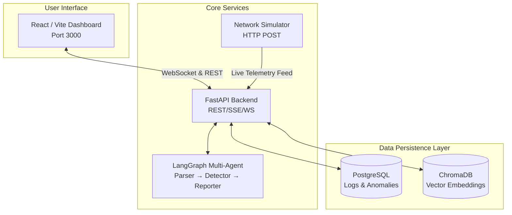
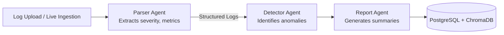

# TeleGuard AI Pro 🛡️

> **Intelligent Telecom Network Monitor** — A production-grade AI platform for real-time BSNL network anomaly detection, predictive failure analysis, and RAG-powered log intelligence.

---

## 🚀 Tech Stack

<p align="center">
  
  
  
  
  
  
</p>

---

## 📐 Architecture

### System Architecture



### Multi-Agent Pipeline



---

## ✨ Key Features

| Feature | Description |
|---|---|
| 🤖 **Multi-Agent AI Pipeline** | LangGraph workflow with 3 specialized agents working in sequence (Parser → Detector → Reporter) |
| 🔍 **RAG Chat** | Semantic search over logs using ChromaDB + sentence-transformers with streaming SSE responses |
| 🗣️ **Voice Interface** | Integrated Speech-to-Text input and Text-to-Speech responses within the AI chat |
| 🔮 **Predictive Failure Scoring** | Exponential rate analysis scoring each tower 0-100 to assess future failure risk |
| 🗺️ **Network Topology** | Interactive force-directed graph on an India map featuring real-time health coloring and 12h trend sparklines |
| 📡 **Live WebSocket Feed** | Low-latency, real-time log streaming directly from the network simulator to the frontend dashboard |
| 🌡️ **Signal Heatmap** | Dynamic RSSI-based coverage map with animated regional markers |
| 🔎 **NL → SQL Explorer** | LLM-powered natural language queries translated instantly into safe SELECT statements |
| 📊 **KPI Analytics** | Track severity trends, latency by region, TRAI compliance, and tower availability in real-time |
| 📋 **Anomaly Correlation** | Automatically detects cascade failures and cross-region correlated events |
| 📄 **PDF Report Generation** | Download branded PDF analysis reports detailing severity breakdowns, anomaly tables, and AI insights |
| ⬇️ **CSV Data Export** | One-click export of data query results directly from the NL→SQL explorer |
| 🐳 **One-Click Deployment** | A unified Docker Compose setup spins up the backend, frontend, postgres, chromadb, and simulator |

---

## 🏃 Quick Start

### Prerequisites
- Docker & Docker Compose installed
- Groq API key (free at [console.groq.com](https://console.groq.com))

### 1. Clone & Configure
```bash
git clone https://github.com/Rudrr22/BSNL-Project.git
cd BSNL-PROJECT

# Set up your environment variables
cp .env.example .env
# Edit .env and insert your GROQ_API_KEY
```

### 2. Launch Platform
```bash
docker compose up --build
```
This single command spins up everything:
- 🌐 **Frontend Dashboard**: [http://localhost:3000](http://localhost:3000)
- ⚙️ **Backend API**: [http://localhost:8000](http://localhost:8000)
- 📚 **Interactive API Docs**: [http://localhost:8000/docs](http://localhost:8000/docs)
- 🗄️ **PostgreSQL**: `localhost:5432`
- 🧠 **ChromaDB**: `localhost:8001`

### 3. Verify System Health
```bash
curl http://localhost:8000/health/detailed
```

---

## 📁 Project Structure

```text
BSNL PROJECT/
├── backend/
│   ├── agents/              # LangGraph multi-agent orchestration
│   ├── ml/                  # Predictive failure modeling algorithms
│   ├── rag/                 # RAG pipeline & ChromaDB embeddings setup
│   ├── models/              # SQLAlchemy ORM models & Pydantic schemas
│   ├── routes/              # FastAPI routing (chat, logs, kpis, analysis)
│   ├── utils/               # PDF generation & helper functions
│   └── main.py              # Application entrypoint & WebSocket config
├── frontend/
│   └── src/
│       ├── pages/           # Dashboard, KPIs, Topology, Chat, Explorer, etc.
│       └── components/      # Reusable styled UI elements
├── simulator/
│   └── log_generator.py     # Emulates realistic BSNL network telemetry
├── docker-compose.yml       # Multi-container orchestration
└── .env                     # Secrets and configurations
```

---

## 🔌 Core API Endpoints

| Method | Endpoint | Purpose |
|---|---|---|
| `POST` | `/api/logs/upload` | Upload logs for full batch agent analysis |
| `WS`   | `/ws/logs` | Connect to real-time WebSocket for live telemetry data |
| `POST` | `/api/chat/stream` | Interrogate the AI using RAG via Server-Sent Events |
| `POST` | `/api/nl2sql` | Convert natural language into SQL and fetch data |
| `GET`  | `/api/topology` | Fetch detailed force-directed graph node & edge data |
| `GET`  | `/api/analyses/{id}/pdf`| Download a comprehensive, AI-generated PDF report |

> **Note:** Complete, interactive API documentation is automatically generated and available at `/docs` when the backend is running.

---

## 🛠️ Local Development (Without Docker)

If you prefer to run the components individually without Docker:

```bash
# 1. Start the Backend API
cd backend
pip install -r requirements.txt
uvicorn main:app --reload --port 8000

# 2. Start the Frontend Dashboard
cd frontend
npm install
npm run dev

# 3. Start the Network Simulator
cd simulator
python log_generator.py
```

---

## 👤 Author

**Rudransh Bhatt**  
*B.Tech Student | AI & Full-Stack Developer*  
Developed as part of the BSNL Network Monitoring Project.

---
*Powered by LangGraph, FastAPI, and React. Built for enterprise network intelligence.*
